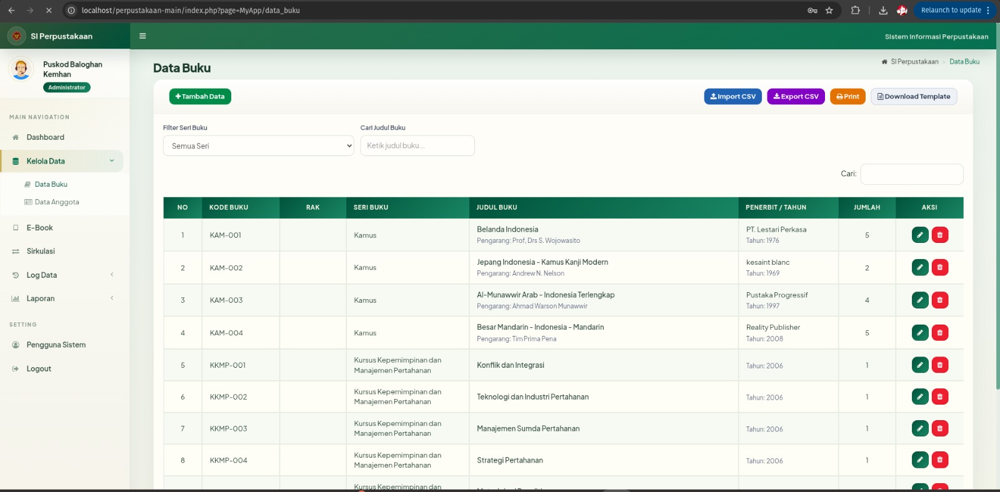
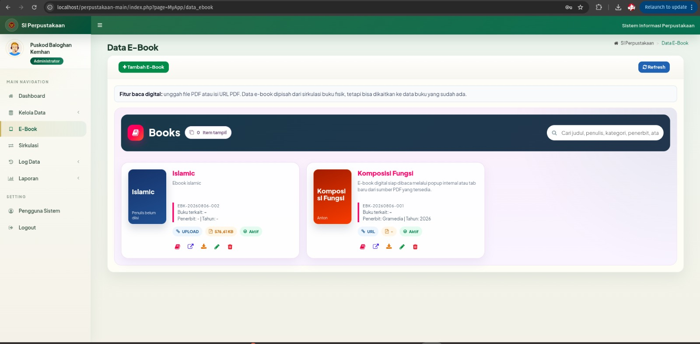

# Sistem Informasi Perpustakaan

Aplikasi perpustakaan berbasis PHP native dan MySQL/MariaDB untuk pengelolaan buku, anggota, sirkulasi peminjaman, laporan, dan katalog e-book.

## Fitur Utama

- Login untuk `Administrator`, `Petugas`, dan `Anggota`
- Dashboard ringkasan statistik perpustakaan
- Manajemen data buku
- Manajemen data anggota
- Sirkulasi peminjaman dan pengembalian
- Laporan dan log sirkulasi
- Katalog e-book beserta unggah file PDF
- Halaman anggota untuk profil, kartu anggota, riwayat pinjam, dan akses e-book

## Teknologi

- PHP
- MySQL / MariaDB
- Bootstrap
- AdminLTE
- jQuery

## Struktur Folder Penting

- `admin/` halaman dan modul admin/petugas
- `member/` halaman area anggota
- `home/` dashboard sesuai peran pengguna
- `inc/` koneksi database dan helper
- `uploads/ebooks/` penyimpanan file e-book PDF
- `assets/`, `assets_style/`, `bootstrap/`, `dist/`, `plugins/` aset antarmuka
- `tools/` skrip bantuan untuk import dan perbaikan data

## Screenshot

### Halaman Data Buku



### Aplikasi Ebook



## Persiapan Lokal

1. Siapkan web server yang mendukung PHP dan MySQL/MariaDB.
2. Buat database baru, misalnya `data_perpus`.
3. Import file `data_perpus.sql` jika ingin memakai struktur awal dan data contoh.
4. Salin `inc/koneksi.example.php` menjadi `inc/koneksi.php`.
5. Ubah kredensial database di `inc/koneksi.php` sesuai server lokal.
6. Pastikan folder `uploads/ebooks/` dapat ditulis oleh web server bila fitur e-book dipakai.
7. Buka `login.php` dari browser.

## Konfigurasi Database

File koneksi yang dipakai aplikasi adalah:

- `inc/koneksi.php` untuk penggunaan lokal/server
- `inc/koneksi.example.php` untuk versi aman yang boleh masuk GitHub

Contoh:

```php
<?php
$koneksi = new mysqli("localhost", "username_db", "password_db", "data_perpus");
?>
```

## Catatan Login

README ini sengaja tidak menampilkan username/password aktif. Untuk lingkungan lokal:

- gunakan akun yang Anda buat sendiri di database, atau
- pakai data contoh dari dump database hanya untuk pengujian internal

Jika repositori akan dipublikasikan, sangat disarankan mengganti seluruh akun contoh dan password lama terlebih dahulu.

## Upload ke GitHub

Sebelum push ke GitHub:

- pastikan `inc/koneksi.php` tidak ikut terunggah
- jangan unggah file Excel/CSV nominatif, backup SQL kerja, dan file PDF e-book privat
- ikuti panduan pada `PUBLIC_PRIVATE_GUIDE.md`

File `.gitignore` di repo ini sudah disiapkan untuk membantu memisahkan file publik dan privat.

## Catatan Keamanan

Beberapa file di proyek ini berisi atau berpotensi berisi data sensitif, misalnya:

- kredensial database
- file impor nominatif anggota
- backup SQL hasil kerja
- file unggahan e-book

Karena itu, lakukan review isi commit sebelum upload ke repositori publik.
